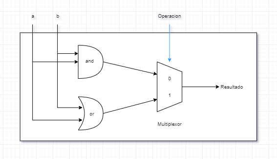

<h2 align="center">Learn x86 assembly language &nbsp;:heart:&nbsp;</h2>


## Niveles 

- Pyhton, Ruby, C# (Alto Nivel)
- C (Nivel Intermedio) <br>
- <B>Ensamblador (Bajo Nivel)</B>
- Lenguaje Maquina

## CPU



## Lenguaje ensamblador x86 🔬

El lenguaje ensamblador x86 es la familia de los lenguajes ensambladores para los procesadores de la familia x86 introducida en abril de 1972, que incluye desde los procesadores Intel 8086 y 8088, pasando por los Pentium de Intel y los Athlon de AMD y llegando hasta los últimos procesadores x86 de estas compañías. Como el resto de lenguajes ensambladores, usa una serie de mnemotécnicos para representar las operaciones fundamentales que el procesador puede realizar. Los compiladores a menudo producen código ensamblador como un paso intermedio cuando traducen un programa de alto nivel a código máquina. Considerado como un lenguaje de programación de bajo nivel y específico para cada máquina. Aunque algunas veces es usado para software de aplicación de sistemas de ventanas, los lenguajes ensambladores son utilizados principalmente en aplicaciones críticas como sistemas de arranque, Sistemas Operativos, núcleos y en controladoras de dispositivos, así como en sistemas en tiempo real o pequeños sistemas

## Historia

Los procesadores Intel 8086 y 8088 fueron los primeros de 16 bits en tener un conjunto de instrucciones conocido actualmente como x86. Fueron un paso evolutivo en comparación con la generación anterior de CPUs de 8 bits, como el 8080 y heredaron muchas características e instrucciones, las cuales fueron extendidas para trabajar con 16 bits. Ambos CPUs contenían un bus de direcciones de 20 bits y un grupo de registros internos de 16 bits. El 8086 tenía un bus de datos externo de 16 bits y el 8088 uno de 8 bits. El 8088 estaba previsto como una versión de bajo coste del 8086. El lenguaje ensamblador del x86 también cubre las diferentes versiones de CPU que siguieron, como el 80188 y 80186, 80286, 80386, 80486, Pentium, etc, de Intel, también como los CPU de AMD y Cyrix como los procesadores 5x86 y K6, y el NEC V20 de NEC. El término x86 aplica a cualquier CPU pueda correr el lenguaje ensamblador original (usualmente también correrá por lo menos algunas de las extensiones.)


## Mnemotécnicos y códigos de operación

Cada instrucción del x86 está representada por un mnemotécnico, que traduce directamente a una serie de bytes la representación de la instrucción, llamada código de operación. Por ejemplo, la instrucción NOP se codifica como 0x90 y la instrucción HLT como 0xF4. Algunos códigos de operación no tienen nombres mnemotécnicos y no están documentados. Diferentes procesadores en la familia del x86 pueden interpretar códigos de operación indocumentados de forma distinta, haciendo que un mismo programa se comporte de forma distinta en diferentes procesadores.


## Sintaxis

El lenguaje ensamblador x86 tiene 2 vertientes diferentes en cuanto a su sintaxis de programación: sintaxis Intel, usada en sus inicios para la documentación de la plataforma x86, y sintaxis AT&T .1 La sintaxis Intel es la dominante en la plataforma Windows, mientras que en Unix/Linux ambas son utilizadas aunque GCC solo soportaba la sintaxis AT&T en sus primeras versiones.

La mayoría de los ensambladores x86 utilizan la sintaxis de Intel, como MASM, TASM, NASM, FASM and YASM. GAS ha soportado ambas sintaxis desde la versión 2.10 a través de la directiva “.intel_sintax”.

## Registros

Los procesadores x86 tienen una serie de registros disponibles para almacenar información. Este conjunto de registros son conocidos como registros de propósito general o GPR (del inglés General Purpose Register).

Además de los GPR, existen adicionalmente:
- registros de segmento (CS, DS, ES, FS, GS, SS)
- otros registros (IP, Registro de estado)
- registros extra (MMX, 3DNow!, SSE, etc).

El registro IP apunta a la posición del programa en la que el procesador está ejecutando el código. EL registro no puede ser accedido por el programador directamente.

Los registros del x86 pueden ser usados mediante la instrucción MOV. Por ejemplo:
```
 mov ax, 1234h
 mov bx, ax
```
## Modos de ejecución

El procesador soporta numerosos modos de operación para código x86, en los cuales no todas las instrucciones están disponibles. Un sub-repertorio de instrucciones de 16-bit está disponible en “modo real” (disponible en todos los procesadores x86), “modo protegido 16-bit” (disponible desde el Intel 80286), o en el “modo v86” (disponible desde el Intel 80386). Por su parte, las instrucciones de 32-bits están disponibles para el “modo protegido 32-bit” y para el “modo heredado” (disponible con las extensiones de 64 bits). El repertorio de instrucciones parte de ideas similares en cada modo, pero da lugar a distintas formas de acceso a memoria y de este modo emplea estrategias de programación diferentes.

Los modos en los que el código x86 puede ser ejecutado son:

- Modo real (16-bit)
- Modo protegido (16-bit y 32-bit)
- Modo 8086 virtual (16-bit)
- System Management Mode (16-bit)
- Modo largo (64-bit)


